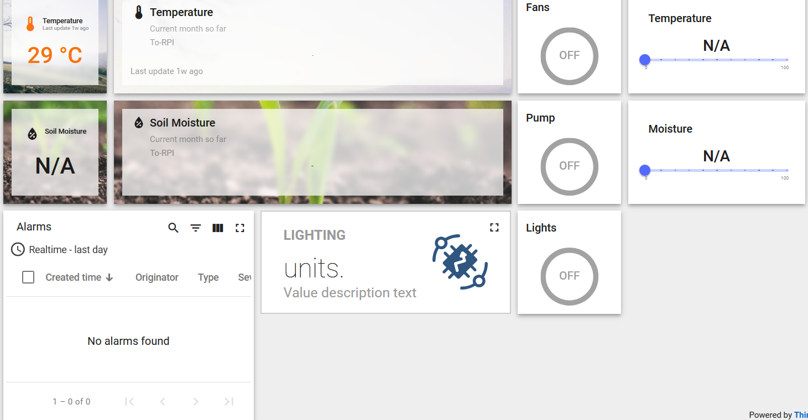
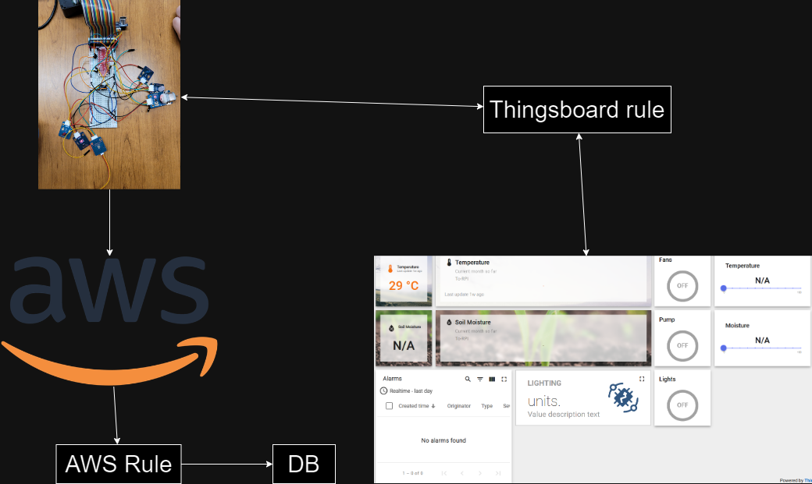

### Necessary components
 - photoresistor
 - thermistor
 - soil moisture
 - fan
 - RGB LED
 - 2 LEDs

### UI Mockup:

### Usage Instructions:

### Architecture Diagram:

### Wiring

### Screenshots:
