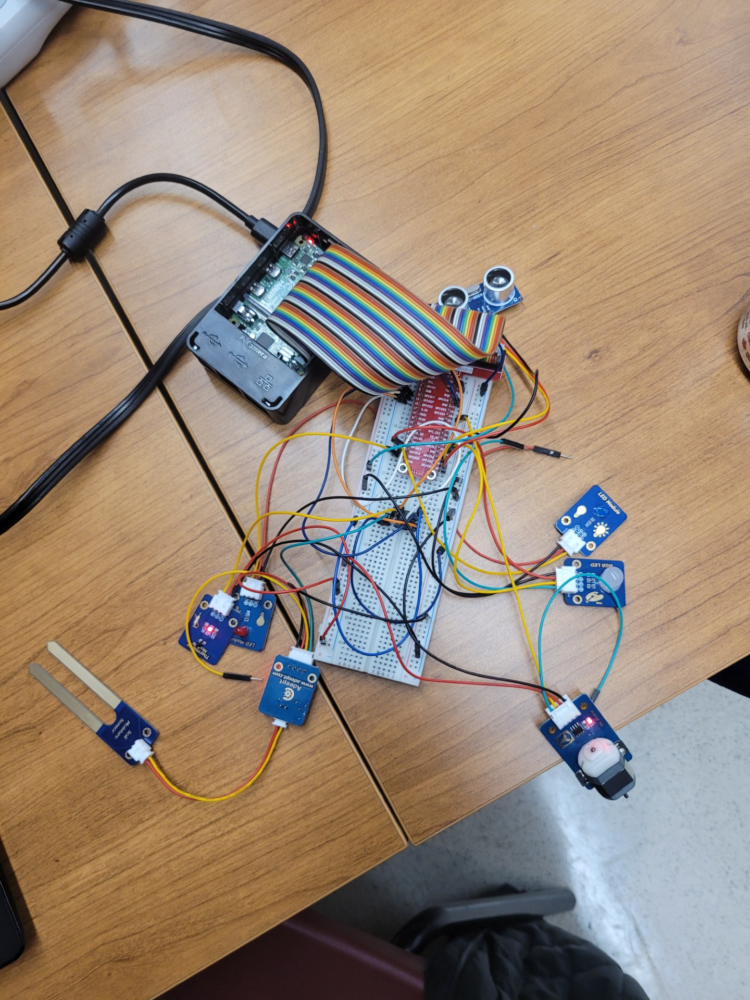
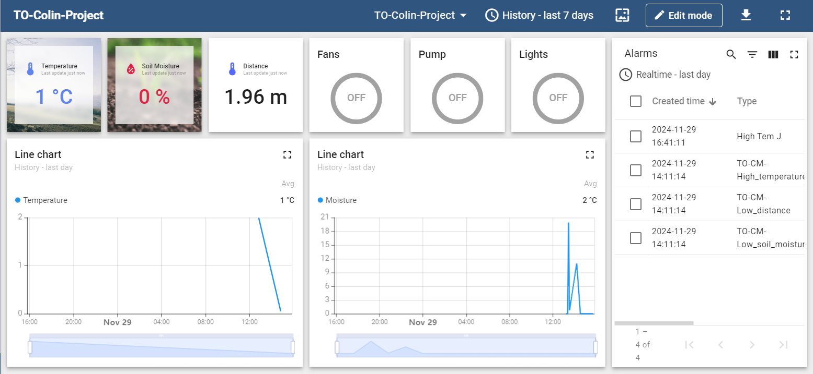
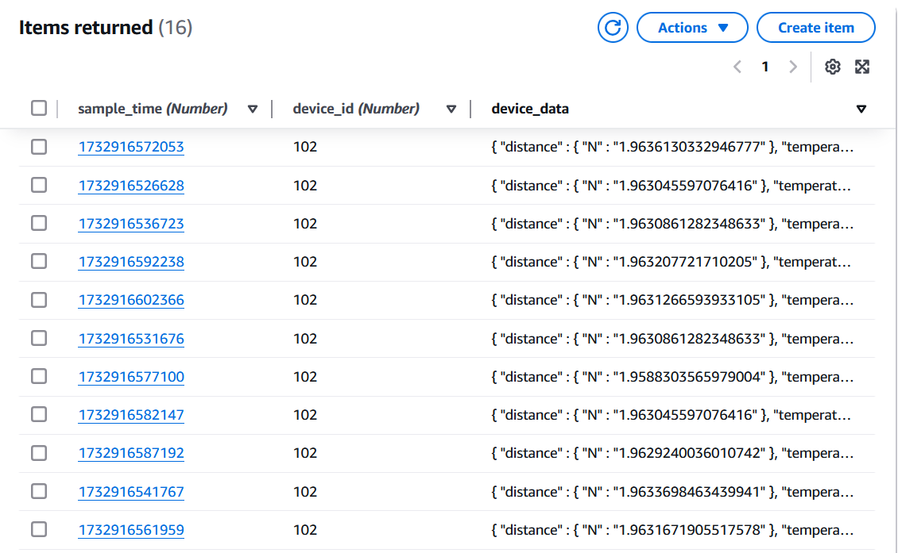
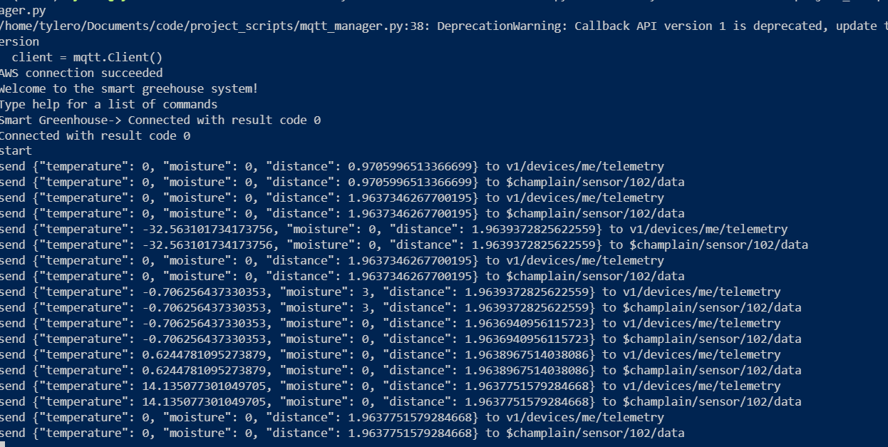

### Necessary components
 - photoresistor
 - thermistor
 - soil moisture
 - fan
 - RGB LED
 - 2 LEDs

### Usage Instructions:
Wire according to the diagram. Copy your certs folder into the working directory 
that contains AWS certificates edit the config file accordingly. Run mqtt_manager.py.
Type "temp" to configure temperature threshold. Type "moisture" to configure soil 
moisture threshold. Type "start" to start the application.

### UI Mockup:

### Architecture Diagram:

### Wiring

### Screenshots:

## AWS DynamoDB

## Terminal Output:

